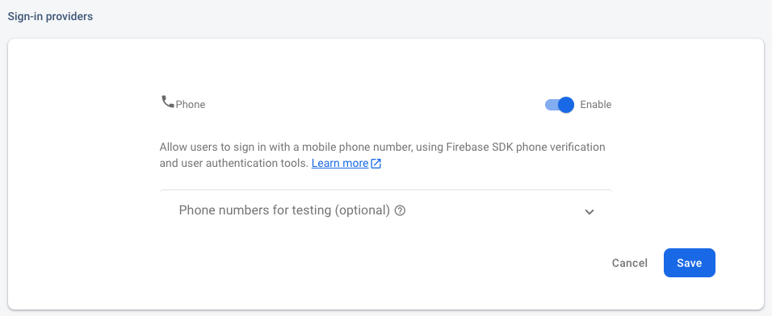

# FlutterFire UI Email provider

## Configuration

To support Phone Numbers as a provider, first ensure that the "Phone" provider is
enabled in the [Firebase Console](https://console.firebase.google.com/project/_/authentication/providers):



Next, follow the [Setup Instructions](https://firebase.google.com/docs/auth/flutter/phone-auth) to configure Phone Authentication for your
platforms.

Configure email provider:

```dart
import 'package:firebase_core/firebase_core.dart';

void main() {
  WidgetsFlutterBinding.ensureInitialized();
  await Firebase.initializeApp(options: DefaultFirebaseOptions.currentPlatform);

  FlutterFireUIAuth.configureProviders([
    PhoneAuthProvider(),,
    // ... other providers
  ]);
}
```

## Using screen

After adding `PhoneAuthProvider` to the `FlutterFireUIAuth.configureProviders`, a button will be added to the `SignInScreen` and `RegisterScreen`.

```dart
SignInScreen(
  actions: [
    VerifyPhoneAction((context, _) {
      Navigator.pushNamed(context, '/phone');
    }),
  ],
);
```

> Notes:
>
> - see [navigation guide](../navigation.md) to learn how navigation works with FlutterFire UI.
> - explore [FlutterFireUIActions API docs](https://pub.dev/documentation/flutterfire_ui/latest/auth/FlutterFireUIAction-class.html).

Configure a `'/phone'` route to render `PhoneInputScreen`:

```dart
MaterialApp(
  routes: {
    // ...other routes
    '/phone': (context) => PhoneInputScreen(
      actions: [
        SMSCodeRequestedAction((context, action, flowKey, phoneNumber) {
          Navigator.of(context).push(
            MaterialPageRoute(
              builder: (context) => SMSCodeInputScreen(
                flowKey: flowKey,
              ),
            ),
          );
        }),
      ]
    ),
  }
)
```

## Using view

If the pre-built screens don't suite the app needs, you could use a `PhoneInputView` to build your custom screen:

```dart
final _flowKey = Object();

class MyLoginScreen extends StatelessWidget {
  @override
  Widget build(BuildContext) {
    return Scaffold(
      body: Row(
        children: [
          MyCustomSideBar(),
          Padding(
            padding: const EdgeInsets.all(16),
            child: FlutterFireUIActions(
              actions: [
                SMSCodeRequestedAction((context, action, flowKey, phoneNumber) {
                  Navigator.of(context).push(
                    MaterialPageRoute(
                      builder: (context) => SMSCodeInputScreen(
                        flowKey: flowKey,
                      ),
                    ),
                  );
                }),
              ],
              child: PhoneInputView(flowKey: flowKey),
            ),
          )
        ],
      ),
    );
  }
}
```

## Using widget

If a view is also not flexible enoguh, there is an `PhoneInput` and `SMSCodeInput` widgets:

```dart
class MyCustomWidget extends StatefulWidget {
  @override
  State<MyCustomWidget> createState() => _MyCustomWidgetState();
}

class _MyCustomWidgetState extends State<MyCustomWidget> {
  Widget child = PhoneInput(initialCountryCode: 'US');

  @override
  Widget build(BuildContext context) {
    return AuthStateListener<PhoneAuthController>(
      listener: (oldState, newState, controller) {
        if (newState is SMSCodeSent) {
          setState(() {
            child = SMSCodeInput(
              onSubmit: (code) {
                controller.verifySMSCode(
                  code,
                  verificationId: newState.verificationId,
                  confirmationResult: newState.confirmationResult,
                );
              },
            );
          });
        }
        return null;
      },
      child: child,
    );
  }
}
```

## Building a custom widget with AuthFlowBuilder

You could also use `AuthFlowBuilder` to facilitate the functionality of the `PhoneAuthFlow`:

```dart
class MyCustomWidget extends StatelessWidget {
  @override
  Widget build(BuildContext context) {
    return AuthFlowBuilder<PhoneAuthController>(
      listener: (oldState, newState, controller) {
        if (newState is PhoneVerified) {
          Navigator.of(context).pushReplacementNamed('/profile');
        }
      },
      builder: (context, state, ctrl, child) {
        if (state is AwaitingPhoneNumber) {
          return PhoneInput(
            initialCountryCode: 'US',
            onSubmit: (phoneNumber) {
              ctrl.acceptPhoneNumber(phoneNumber);
            },
          );
        } else if (state is SMSCodeSent) {
          return SMSCodeInput(onSubmit: (smsCode) {
            ctrl.verifySMSCode(
              smsCode,
              verificationId: state.verificationId,
              confirmationResult: state.confirmationResult,
            );
          });
        } else if (state is SigningIn) {
          return CircularProgressIndicator();
        } else if (state is AuthFailed) {
          return ErrorText(exception: state.exception);
        } else {
          return Text('Unknown state $state');
        }
      },
    );
  }
}
```

## Building a custom stateful widget

For a full control over every phase of the authentication lifecylce you could build a stateful widget, which implements `PhoneAuthController`:

```dart
class CustomPhoneVerification extends StatefulWidget {
  const CustomPhoneVerification({Key? key}) : super(key: key);

  @override
  State<CustomPhoneVerification> createState() =>
      _CustomPhoneVerificationState();
}

class _CustomPhoneVerificationState extends State<CustomPhoneVerification>
    implements PhoneAuthListener {
  final auth = FirebaseAuth.instance;
  late final PhoneAuthProvider provider = PhoneAuthProvider()
    ..authListener = this;

  String? verificationId;
  ConfirmationResult? confirmationResult;

  late Widget child = PhoneInput(
    initialCountryCode: 'US',
    onSubmit: (phoneNumber) {
      provider.sendVerificationCode(phoneNumber, AuthAction.signIn);
    },
  );

  @override
  void onCodeSent(String verificationId, [int? forceResendToken]) {
    this.verificationId = verificationId;
  }

  @override
  void onConfirmationRequested(ConfirmationResult result) {
    this.confirmationResult = result;
  }

  @override
  void onSMSCodeRequested(String phoneNumber) {
    setState(() {
      child = SMSCodeInput(
        onSubmit: (smsCode) {
          provider.verifySMSCode(action: AuthAction.signIn, code: smsCode);
        },
      );
    });
  }

  @override
  void onVerificationCompleted(PhoneAuthCredential credential) {
    provider.onCredentialReceived(credential, AuthAction.signIn);
  }

  @override
  Widget build(BuildContext context) {
    return Center(child: child);
  }

  @override
  void onBeforeCredentialLinked(AuthCredential credential) {
    setState(() {
      child = CircularProgressIndicator();
    });
  }

  @override
  void onBeforeProvidersForEmailFetch() {
    setState(() {
      child = CircularProgressIndicator();
    });
  }

  @override
  void onBeforeSignIn() {
    setState(() {
      child = CircularProgressIndicator();
    });
  }

  @override
  void onCanceled() {
    setState(() {
      child = Text("Phone verification cancelled");
    });
  }

  @override
  void onCredentialLinked(AuthCredential credential) {
    Navigator.of(context).pushReplacementNamed('/profile');
  }

  @override
  void onDifferentProvidersFound(
      String email, List<String> providers, AuthCredential? credential) {
    showDifferentMethodSignInDialog(
      context: context,
      availableProviders: providers,
      providers: FlutterFireUIAuth.providersFor(FirebaseAuth.instance.app),
    );
  }

  @override
  void onError(Object error) {
    try {
      // tries default recovery strategy
      defaultOnAuthError(provider, error);
    } catch (err) {
      setState(() {
        defaultOnAuthError(provider, error);
      });
    }
  }

  @override
  void onSignedIn(UserCredential credential) {
    Navigator.of(context).pushReplacementNamed('/profile');
  }
}
```

## Other topics

- [Email verification](./email-verification.md)
- [EmailLinkAuthProvider](./email-link.md) - allows to register and sign in using a link sent to email.
- [PhoneAuthProvider](./phone.md) - allows to register and sign in using a phone number
- [UniversalEmailSignInProvider](./universal-email-sign-in) - gets all connected auth providers for a given email.
- [OAuth](./oauth.md)
- [Localization](../localization.md)
- [Theming](../theming.md)
- [Navigation](../navigation.md)
